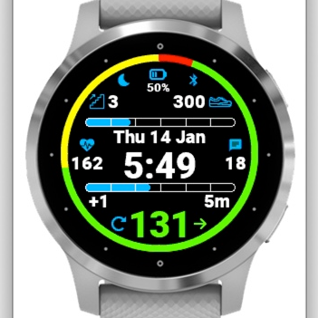
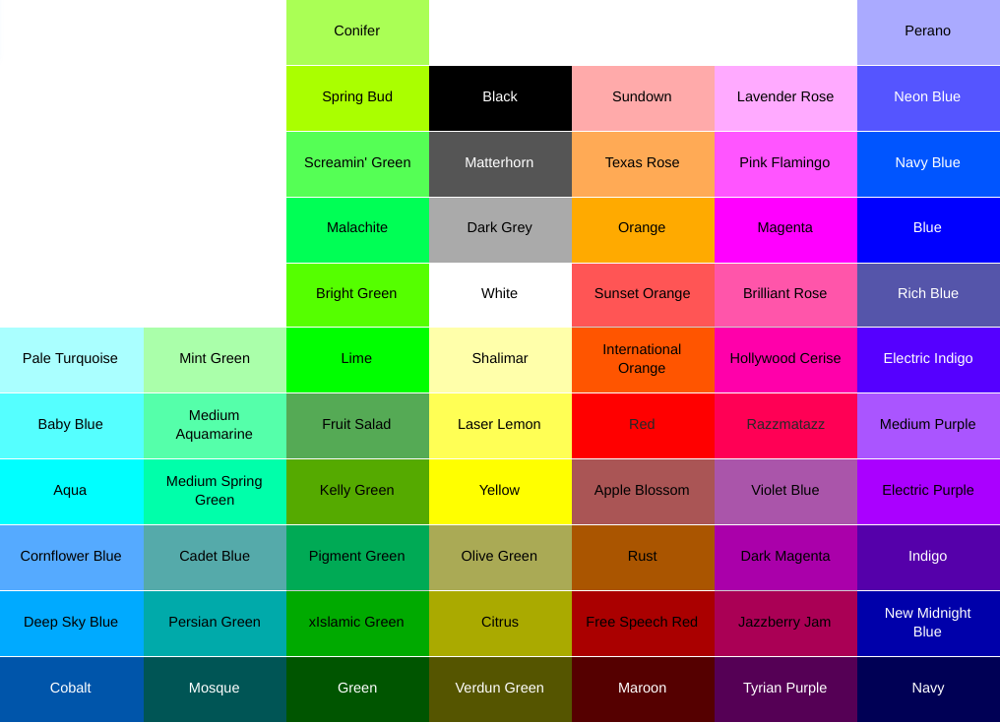

# CGM TIR Project Overview

This project began as a collaboration between Dana (T1D,xdrip+,openAPS,NS, Medtronic, Dexcom G6 user) and John (software developer boyfriend).  Dana purchased a Garmin watch to replace her many Pebble watches, but just couldn't find an existing watchface that provided everything she wanted for viewing T1D data.  She sketched out her original idea for a Garmin watchface and John brought it to life using the Garmin SDK.  This page is intended to explain settings, provide insight into our thinking, and share ideas for future development plans in more detail than we can provide in the Connect IQ description.

## Current Projects

- [CGM TIR Garmin Watchface](https://apps.garmin.com/en-US/apps/38c13f6f-3f68-4a08-b58b-1e1089292a6f)

### Watchface Description

CGM TIR watchface provides a clean & simple design that provides users with blood glucose values, trend arrows and deltas, a units remaining in an insulin pump reservoir, openAPS looping status, and a motivational time in range (TIR) ring that can be displayed six different ways.  This watchface can be configured to receive data from xDrip+ (Android only) AND Nightscout to allow glucose data to continue to be displayed without an internet connection OR with data collected from Nightscout only (cell service/internet connection required). Color schemes are fully customizable in the watch configuration settings. The watchface currently displays heart rate, stairs climbed, steps and a step goal progress bar, a phone notification count, watch battery level, bluetooth connectivity, and a watch Do Not Disturb indicator. The pump insulin units remaining are displayed a visual status bar similar to the step goal display.  The watchface is currently optimized for openAPS looping and xDrip+ as the local data source.  If you would like to use Nightscout only without xDrip+, select "Other/None" in the local collector setting.

### Watchface Settings & Configurations

**Local Glucose Data Source:** Xdrip+ (Android) is currently the only supported local collector to allow the watch to continue to receive SGV (glucose) data without cell/internet service for the phone/watch.  This setting should be set to **"other/none"** if you **do not** use xdrip+.  We are interested in supporting other local collector options, but would need people who are willing to test those changes, as well as provide us with small samples of data formatting to help make those changes.  **The default setting is Xdrip+**.  

**Nightscout URL Primary User:** This is currently a **required** setting.  The initial data needed to populate the TIR ring is pulled from nighscout.  This requires the phone/watch to have internet/cell connectivity to retrieve this data. In future releases for multiple users, this will be the URL for the data displayed on the **bottom** of the watch screen.  No default value - **make sure you enter _your_ URL upon setup**

**Pump Max Reservoir Size:** This will be used as the total for the bottom bar display on the single-user watchface.  Depending on what makes most sense to you, you may consider entering your total reservoir size, or the units that typically remain after you prime your pump.  **The default value is 300 units**.  

**Units:** Choose mg/dL or mmol/L, depending on which units you would prefer to display on the watch.  **The default setting is mg/dL**.  

**Target Range: Low:** The lowest number you would like to be considered "in range".  Another way of thinking of this is everything below this number will be counted as a **"low"** glucose value.  Note: On some android devices, this may show as a number with several zeros after the decimal point - you can still enter a whole number as your value.  **The default value is 70 mg/dL**.  

**Target Range: High:** The highest number you would like to be considered "in range".  Another way of thinking of this is everything above this number will be counted as a **"high"** glucose value.  Note: On some android devices, this may show as a number with several zeros after the decimal point - you can still enter a whole number as your value. **The default value is 150 mg/dL**.  

**Time in Range Ring Type:** There are 3 choices in this setting, with two reset options for each, giving a total of 6 different TIR ring options.  **The default setting is 24-Hour Circle Graph Summary**. 
- **5 Minute Time-Oriented Segments:** This option begins drawing sections of the ring using your Low, Normal, and High color choices (see below) in five minute intervals.  The ring is drawn from noon/midnight, and the segments are oriented so that they correspond to the correct time location on an anolog watchface, so 90 degrees clockwise from noon/midnight would show a segment starting at 9am or 9pm.  24 hours is not an option for this ring type since it is oriented to match standard time-telling analog watch orientation.  

- **12-Hour Circle Graph Summary:** This option draws your TIR as a percentage of the overall circle for up to 12 hours of data.  Another way of thinking of this is that all of the segments from the Time-Oriented option above are instead grouped together as Low, Normal, and High, using your color choices (see below).  You can choose to show a continuous 12 hours, or only show from noon/midnight to the current time.  

- **24-Hour Circle Graph Summary:** This option draws your your TIR as a percentage of the overall circle for up to 24 hours of data.  It will show your Low, Normal, and High values grouped together using your color choices (see below).  

**TIR Ring Reset:** **The default setting is Rolling/Continuous**.  
- **Rolling/Continous:** This setting will always show you the past 12/24 hours of data (based on your Ring Type choice).  Note: For the 5 Minute Time-Oriented Segments, everything drawn clockwise from the current time marker to noon/midnight is data from prior to noon/midnight.

- **Midnight/Noon:** For 24-hour Circle Graph Summary, this means a midnight reset, so the watch will always be showing you your % TIR for that current date.  This will match what you are used to seeing in X-drip statistics.  For the 12 hour options (12-Hour Circle and 5 Minute Time-Oriented), this will include data from noon/midnight (whichever is more recent) to the current time.  Note: In the 5 Minute Time-Oriented mode, this will result in a partial ring, as there will be a gap from the current time clockise to noon/midnight.  

**TIR Ring Width (1-30):** This value is expressed in pixels.  Changing this setting to 1 will give you an extremely thin ring.  Changing this setting to 30 will give you an extremely wide ring.  **The default setting is 14 pixels**.  

**Stale Data Warning:** This value is expressed in minutes and represents the point at which data/icons should be re-drawn using your High color choice (see below) to indicate that the data is old.  **The default setting is 6 minutes**.  

**Stale Data Urgent:** This value is expressed in minutes and represents the point at which data/icons should be removed from the screen or re-drawn using your Low color choice (see below) to indicate that the data is extremely old.  **The default setting is 60 minutes**.

**Color Choices:**
Select from the 64-color choices available in Garmin's device specifications for each of the following:
- **Background** Default is Black. (Note: **Do not** make this the same as any of your other color settings)
- **Foreground** Default is White. (This includes the outlines for the progress bars, time/date, and all (non-stale) numbers with the exception of glucose value)
- **Icon Color** Default is Deep Sky Blue. (outlined when no value/goal not met, filled when goal met, unread notications, or active heart rate reading)
- **SGV Low** Default is Red. (used for glucose value and arrow, TIR ring, and urgent levels for pump reservoir, battery, stale data, and looping error)
- **SGV Normal** Default is Bright Green. (used for glucose value and arrow, TIR ring) 
- **SGV High** Default is Yellow. (used for glucose value and arrow, TIR ring, and warning levels for pump reservoir, battery, stale data, and looping warning)

### Troubleshooting

 
Data won't load

  
  ## Check Your Nighscout URL in Settings
  1. Due to memory constraints, 12-24 hours of data must be returned from Nightscout before the watch can begin pulling from a local collector (if set), so if the watch won't load at all, this is the first thing you need to rule out.  
  2. **Your Nightscout URL** is the only setting that you are **required** to update from the default settings.  
     * Make sure that you have included **https://** at the beginning of the URL, and don't include any additional information beyond **.com**.  
     * If you enter your URL incorrectly, you may have to wait up to 5 additional minutes after fixing this setting for data to populate - please be patient!  

 
TIR ring segments are incorrect

  
  ## Check ange & Ring Settings
  1. Make sure that your Target Range High and Low values are in the correct units.  If you picked mg/dL, make sure your range values are expressed that way.  If you chose mmol/L, make sure your range values are expressed that way (the default settings will not make sense in mmol/L).  
  2. If there is a gap in your data that you weren't expecting, you may have selected Noon/Midnight reset instead of Rolling/Continuous reset. Noon/Midnight reset will only show you data from 12a or 12p (whichever was more recent) to the current time, so you will see a gap in the data from the current time clockwise back to 12a or 12p.   

 
Icons/values disappeared

 
 ## Check Color Choices & Stale Data
  1. If your background color is the same as any of your other color choices, those items will not be visable on the watchface.  If you choose a background color that is similar to your icon/foreground color, items may be present but difficult to see.   
  2. If your data source has reached the Stale Data Urgent threshold that you set, icons and values from that data source will disappear from the watchface.  
   * Check to make sure your watch is in range of your phone. 
   * If nightscout data is lost, check to see if you have cell/internet connection

### Have the developers considered...?

### What's up next in development?
- CGM TIR Watchface supporting two T1Ds
- Adding additional local collector options

### Support or Contact

Use the _Contact Developer_ option for the watchface in the [Garmin Connect IQ Store](https://apps.garmin.com/en-US/apps/38c13f6f-3f68-4a08-b58b-1e1089292a6f)

