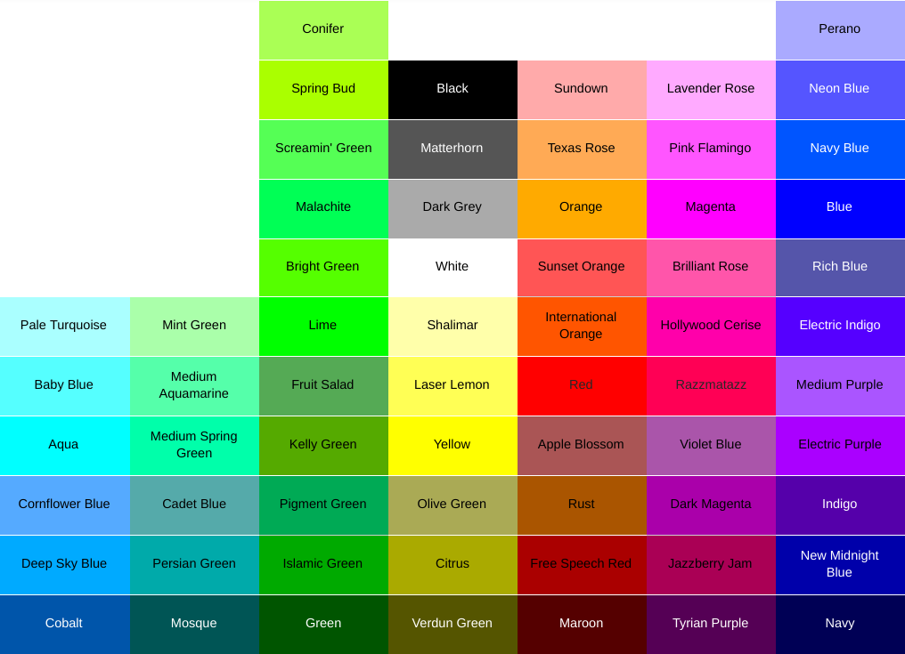

## Local Glucose Data Source:
Xdrip+ (Android) is currently the only supported local collector to allow the watch to continue to receive SGV (glucose) data without cell/internet service for the phone/watch.  This setting should be set to **"other/none"** if you **do not** use xdrip+.  We are interested in supporting other local collector options, but would need people who are willing to test those changes, as well as provide us with small samples of data formatting to help make those changes.  **The default setting is Xdrip+**.  

## Nightscout URL Primary User:
This is a **required** setting.  The initial data needed to populate the TIR ring is pulled from nighscout.  This requires the phone/watch to have internet/cell connectivity to retrieve this data. This is the URL for the data displayed on the **bottom** of the watch screen and for the **outer** TIR ring. No default value - **make sure you enter _your_ URL upon setup**

## Nightscout Token Primary User:(Optional) 
If your nightscout site is set up to require token-based authentication, the watchface requires "readable" access to your nightscout site.  Enter just the Access Token (everything after _?token=_ in the Token URL).  No default value. 

## Pump Max Reservoir Size Primary User:
This will be used as the total for the bottom bar display on the single-user watchface.  Depending on what makes most sense to you, you may consider entering your total reservoir size, or the units that typically remain after you prime your pump.  **The default value is 300 units**.  

## Units:
Choose mg/dL or mmol/L, depending on which units you would prefer to display on the watch.  **The default setting is mg/dL**.  

## Primary Target Range: Low:
The the first or highest number you would like considered "low".  Another way of thinking of this is this number and everything below it will be counted as a **"low"** glucose value.  Note: On some android devices, this may show as a number with several zeros after the decimal point - you can still enter a whole number as your value.  **The default value is 70 mg/dL**.  

## Primary Target Range: High:
The first or lowest number you would like to be considered "high".  Another way of thinking of this this number and everything above it will be counted as a **"high"** glucose value.  Note: On some android devices, this may show as a number with several zeros after the decimal point - you can still enter a whole number as your value. **The default value is 150 mg/dL**.  

## Time in Range Ring Type:
There are 3 choices in this setting, with two reset options for each, giving a total of 6 different TIR ring options.  The default setting is **24-Hour Circle Graph Summary**. 
- **5 Minute Time-Oriented Segments:** This option begins drawing sections of the ring using your Low, Normal, and High color choices (see below) in five minute intervals.  The ring is drawn from noon/midnight, and the segments are oriented so that they correspond to the correct time location on an anolog watchface, so 90 degrees clockwise from noon/midnight would show a segment starting at 9am or 9pm.  24 hours is not an option for this ring type since it is oriented to match standard time-telling analog watch orientation.  

- **12-Hour Circle Graph Summary:** This option draws your TIR as a percentage of the overall circle for up to 12 hours of data.  Another way of thinking of this is that all of the segments from the Time-Oriented option above are instead grouped together as Low, Normal, and High, using your color choices (see below).  You can choose to show a continuous 12 hours, or only show from noon/midnight to the current time.  

- **24-Hour Circle Graph Summary:** This option draws your your TIR as a percentage of the overall circle for up to 24 hours of data.  It will show your Low, Normal, and High values grouped together using your color choices (see below).  

## TIR Ring Reset:
The default setting is **Rolling/Continuous**.  
- **Rolling/Continous:** This setting will always show you the past 12/24 hours of data (based on your Ring Type choice).  Note: For the 5 Minute Time-Oriented Segments, everything drawn clockwise from the current time marker to noon/midnight is data from prior to noon/midnight.

- **Midnight/Noon:** For 24-hour Circle Graph Summary, this means a midnight reset, so the watch will always be showing you your % TIR for that current date.  This will match what you are used to seeing in X-drip statistics.  For the 12 hour options (12-Hour Circle and 5 Minute Time-Oriented), this will include data from noon/midnight (whichever is more recent) to the current time.  Note: In the 5 Minute Time-Oriented mode, this will result in a partial ring, as there will be a gap from the current time clockise to noon/midnight.  

## TIR Ring Width (1-30):
This value is expressed in pixels.  Changing this setting to 1 will give you an extremely thin ring.  Changing this setting to 30 will give you an extremely wide ring.  **The default setting is 14 pixels**.  

## Stale Data Warning:
This value is expressed in minutes and represents the point at which data/icons should be re-drawn using your High color choice (see below) to indicate that the data is old.  **The default setting is 16 minutes**.  

## Stale Data Urgent:
This value is expressed in minutes and represents the point at which data/icons should be removed from the screen or re-drawn using your Low color choice (see below) to indicate that the data is extremely old.  **The default setting is 31 minutes**.

## Color Choices:
Select from the 64-color choices available in Garmin's device specifications for each of the following:
- **Background** Default is **Black**. (Note: **Do not** make this the same as any of your other color settings)
- **Foreground** Default is **White**. (This includes the outlines for the progress bars, time/date, and all (non-stale) numbers with the exception of glucose value)
- **Icon Color** Default is **Deep Sky Blue**. (outlined when no value/goal not met, filled when goal met, unread notications, or active heart rate reading)
- **SGV Low** Default is **Red**. (used for glucose value and arrow, TIR ring, and urgent levels for pump reservoir, battery, stale data, and looping error)
- **SGV Normal** Default is **Bright Green**. (used for glucose value and arrow, TIR ring) 
- **SGV High** Default is **Yellow**. (used for glucose value and arrow, TIR ring, and warning levels for pump reservoir, battery, stale data, and looping warning)

## Nightscout URL Secondary User: (Optional)
If you would like to see data for a **2nd diabetic** on this watchface, enter that URL.  This is the URL for the data displayed on the **top** of the watch screen and for the **inner** TIR ring. No default value.  

## Nightscout Token Secondary User: (Optional)
If your **2nd nightscout site** is set up to require token-based authentication, the watchface requires "readable" access to your nightscout site.  Enter just the Access Token (everything after _?token=_ in the Token URL).  No default value. 

## Pump Max Reservoir Size Secondary User: (Optional) 
This will be used as the total for the top bar display for the **2nd diabetic's** pump.  Depending on what makes most sense to you, you may consider entering your total reservoir size, or the units that typically remain after you prime your pump.  **The default value is 300 units**.
